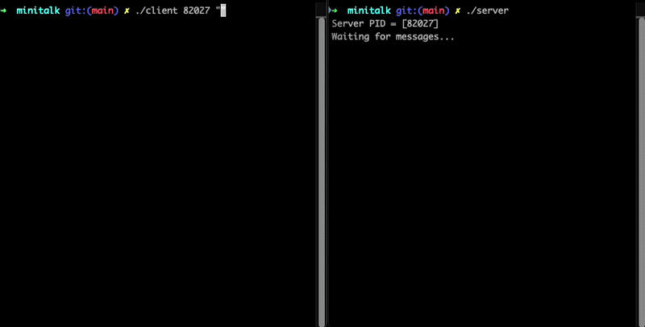

# minitalk

A small client and server pair that sends a text message between two processes
using nothing but UNIX signals. The client turns each character into its 8 bits
and fires one signal per bit, `SIGUSR1` for a 0 and `SIGUSR2` for a 1. The server
catches those signals, rebuilds each byte bit by bit, and prints the message as
it arrives. Built as the 42 "minitalk" project.



## Requirements

A C compiler, `make`, and a POSIX signals implementation. Builds and runs on both
macOS and Linux. The vendored libft builds automatically.

## Build

```sh
make
```

Produces two binaries, `server` and `client`.

## Run

Start the server. It prints its process ID and waits.

```sh
./server
```

```
Server PID = [12345]
Waiting for messages...
```

In another terminal, send a message by passing the server's PID and the string.

```sh
./client 12345 "Hello from minitalk"
```

The server prints the message as the bits come in. It keeps running and waits for
the next message until you stop it with Ctrl-C.

## How it works

- The client validates the PID (digits only, and an existing process) before
  sending anything.
- For each character it walks the 8 bits from most significant to least, sending
  `SIGUSR1` for a 0 bit and `SIGUSR2` for a 1 bit.
- After each bit the client waits for the server to acknowledge it (the server
  sends a signal back) before sending the next one, with a short delay between
  bits. This keeps the two sides in step so no bit is lost.
- The server keeps a static bit counter and a byte under construction in its
  signal handler. Each signal sets or clears one bit, and once 8 have arrived the
  finished character is printed and the counter resets.
- A null byte marks the end of the string, at which point the server prints a
  blank line and waits for the next message.
